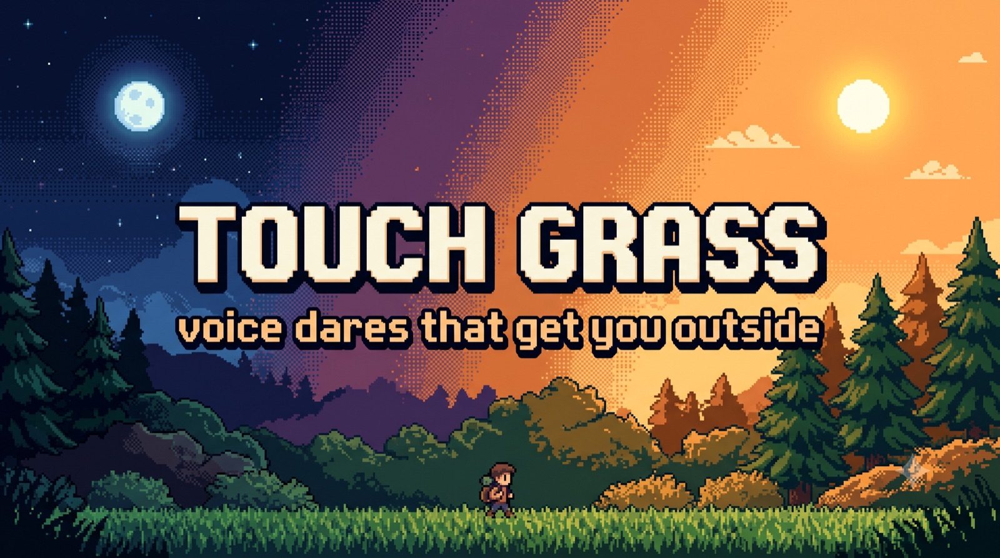
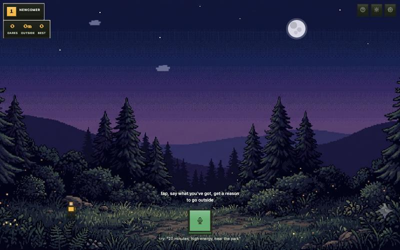
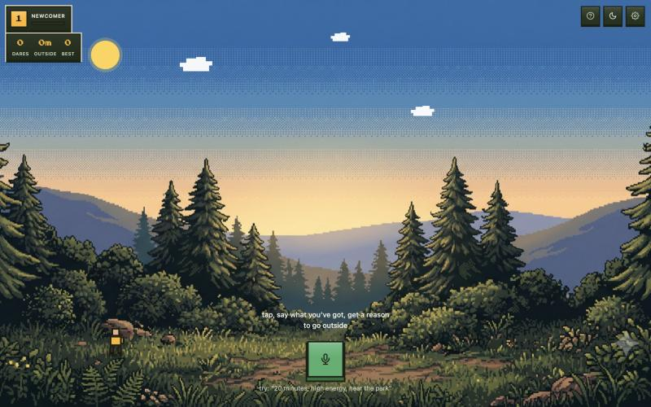
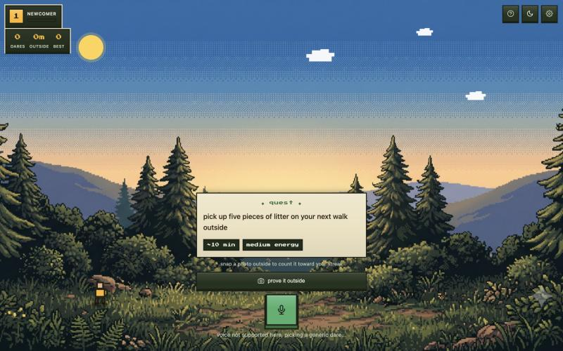

# Touch Grass

**Voice dares that get you off the screen and outside.** Say how much time and
energy you've got, and it hands you one short, concrete dare to go do outside —
then you snap a photo as proof and build a daily streak. One dare, go outside,
come back later. No feed, no infinite scroll.

Built for the [Hacktoberfest Open-Source AI Challenge, Week 1: "Touch Grass"](https://dev.to/challenges/hacktoberfest-week1-2026-10-05).

🔗 **Live:** https://touch-grass-bkii.onrender.com

---

## What it looks like

The whole app is a little outdoor world you stand in. The painted pixel-art
scene fills the screen, your character stands in the grass, and the controls
pin to the edges like a game HUD — nothing floats in a box over the middle.



Flip the theme and the same world re-lights from a cozy night to a warm
daytime — the backdrop crossfades, the moon slides out and the sun comes up.



Tap the mic, say your time and energy, and a dare slides up from the bottom in
a dialogue ribbon — tagged with roughly how long it takes and how much energy
it'll cost — with a "prove it outside" button that opens the camera.



---

## How it works

- **Default mode needs zero setup.** Say your time/energy/place, it matches you
  against a small curated dare bank (`dares.json`) and speaks the result with
  the browser's own `speechSynthesis`. Always works, offline, nothing to configure.
- **Optional smart layer:** paste a Hugging Face token in settings and dare
  generation switches to [Gemma 3 270M](https://huggingface.co/onnx-community/gemma-3-270m-it-ONNX)
  via [transformers.js](https://huggingface.co/docs/transformers.js), running
  entirely in your browser via WASM — not a hosted API call.
- **Optional nicer voice:** add an ElevenLabs key, same pattern — your key, used
  directly from your browser, swappable back to the built-in voice anytime.
- **Proof + streak:** "prove it outside" opens the camera; a photo counts the
  dare toward your dares, minutes outside, and a daily streak.

## Why open

- Dare generation runs **on-device** with Gemma 3 270M, not a hosted API — so
  there's no backend, no API key of mine in the loop, and no bill that scales
  with usage.
- **Works offline after the first load** — a service worker caches the app shell
  and the model, which is the whole point of the "touch grass" theme: it should
  survive exactly the no-signal situation where it's most useful.
- **Nothing leaves your browser.** Your Hugging Face token and ElevenLabs key
  (both optional) are stored locally and used directly from your device.
- **Fully swappable** — change the model, edit `dares.json`, or rip out the
  generation step entirely. It's all plain JS.

## Running it

Just a static site, no build step:

```bash
python3 -m http.server 8000
```

Open `localhost:8000`. Voice input needs Chrome or Edge (Web Speech API support
is patchy elsewhere). Camera proof needs HTTPS or localhost.

## Settings

Open the gear icon (top-right) to optionally add:

- a **Hugging Face token** — enables live dare generation with Gemma 3 270M
- an **ElevenLabs API key** — nicer voice output for the spoken dare

Without either, it falls back to a curated dare list and your browser's built-in
voice — still fully usable, just less smart.

## Tech

Plain HTML / CSS / JS. No framework, no build step, no backend.

| | |
|---|---|
| **Model** | Gemma 3 270M (ONNX) via transformers.js, client-side WASM |
| **Voice in** | Web Speech API (`SpeechRecognition`) |
| **Voice out** | `speechSynthesis`, or ElevenLabs if a key is set |
| **Proof** | `getUserMedia` + canvas |
| **Offline** | service worker precache (app shell + model) |
| **Hosting** | [Render](https://render.com) static site, COOP/COEP headers for the WASM runtime |

## Icons

`icon.svg` is the favicon and manifest icon — modern browsers and Android accept
SVG there directly. `icon-180.png` is a rasterized copy for iOS Safari's "Add to
Home Screen", which ignores SVG. If the icon design changes, re-export
`icon-180.png` from `icon.svg` at 180×180.
